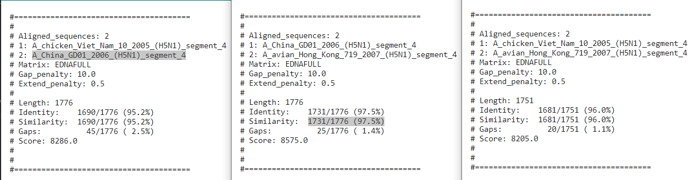

#### Name: Elisia Wright
#### Date: 4 April 2021
#### What this is: Questions in blue from the assignment sheet.

#### Part 1.


 1. Which software did you use to conduct your analysis?

I used the BioPython code from class.

 2. How similar were the two sequences (`s1.fasta` and `s2.fasta`) which you applied an alignment program?

They are similar, as they received a score of 16.

 3. Are the two sequences closely related to each other, in your opinion?

 Yes, I do believe that they are closely related to each other.

 4. What proof do you have to suggest such a claim?

  The purpose of this algorithm is to find all possible alignments with the highest score (after a score is assigned to every possible alignment). After displaying alignments:

  ```
  ATTT--C-ACAGTATTCACTGAG-
  ||||  | ||| | |||||  ||
  ATTTGGCTACA-T-TTCAC--AGT
  ```
  the score of 16 was outputted, considering each sequences had 20 characters each.


#### Part 2
 1. How much similarity exists between each of the sequences to the others?

A = A_chicken_Viet_Nam_10_2005_(H5N1)_segment_4
B = A_China_GD01_2006_(H5N1)_segment_4
C = A_avian_Hong_Kong_719_2007_(H5N1)_segment_4

A -> B: 95.2%
B -> C: 97.5%
A -> C: 96.0%


 2. Based on your results so far (which are too few to provide a comprehensive study), do you believe there is evidence that human adaptation is occurring in H5N1 viruses that might merit concern about human-to-human transmission in the near future?

Yes, based on my results so far, I believe there is evidence that adaptation is occurring, which might lead to concern of human-to-human transmission. Based on results, it is evident that as the years continue, the sequences have become more and more similar, indicating that adaptation may be occurring. 

 3. Statistics: What were the numbers of Lengths, Similarities, Gaps and Scores for each of your alignment tasks?
+-
 

 (a,b) Length: 1776 Similarities: 1690/1776 (95.2%) Gaps: 45/1776 (2.5%) Score: 8286.0

 (b,c) Length: 1776 Similarities: 1731/1776 (97.5%) Gap: 25/1776 (1.4%) Score: 8575.0

 (a,c) Length: 1751 Similarities: 1681/1751 (96.0%) Gap: 20/1751 (1.1%) Score: 8205.0


(Did you remember to add your name to this Markdown file?)
